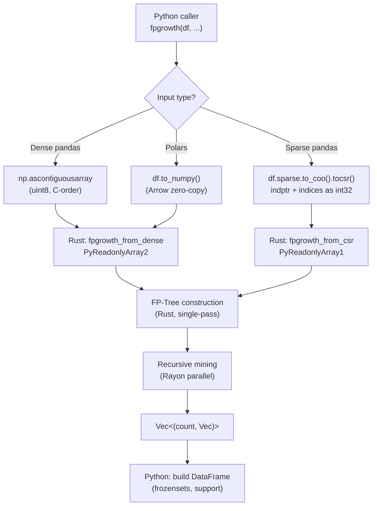

# Architecture

rusket is structured as a thin Python layer over a Rust core, compiled as a native extension module via [PyO3](https://pyo3.rs) and [maturin](https://github.com/PyO3/maturin).

## Repository layout

```
rusket/
├── src/                          # Rust (PyO3)
│   ├── lib.rs                    # Module root — exports to Python
│   ├── fpgrowth.rs               # FP-Tree + FP-Growth algorithm
│   ├── association_rules.rs      # Rule generation + 12 metrics
│   └── common.rs                 # Shared helpers
├── python/
│   ├── rusket/                  # Primary Python package (pyproject.toml name)
│   │   ├── __init__.py
│   │   ├── fpgrowth.py           # Dispatch + numpy conversion
│   │   ├── association_rules.py  # Label mapping + Rust call
│   │   └── _validation.py        # Input validation helpers
│   └── fpgrowth_pyo3/            # Legacy compat package
│       └── ...
└── tests/
    ├── conftest.py
    ├── test_fpbase.py            # Shared base test classes
    ├── test_fpgrowth.py          # FP-Growth tests
    ├── test_association_rules.py # Association rules tests
    └── test_benchmark.py         # Performance benchmarks
```

---

## Data flow



---

## FP-Growth algorithm

The Rust implementation follows the classic Han et al. (2000) FP-Growth algorithm:

1. **Header table scan** — count item frequencies; prune items below `min_count`.
2. **FP-Tree construction** — single-pass over transactions; compress into a prefix-tree structure.
3. **Recursive mining** — for each frequent item, extract the conditional pattern base, build a conditional FP-Tree, and mine it recursively.
4. **Output** — each leaf path materialises as one frequent itemset `(count, items)`.

### Dispatch paths

| Path | Rust function | Input shape | Notes |
|---|---|---|---|
| Dense pandas | `fpgrowth_from_dense` | `[n_rows × n_cols]` uint8 | Contiguous C array |
| Sparse pandas | `fpgrowth_from_csr` | CSR `indptr + indices` | Zero-copy scipy CSR |
| Polars | `fpgrowth_from_dense` | same as dense | Arrow → NumPy view |

---

## Association rules

Rule generation is vectorised in Rust:

1. For each frequent itemset of length ≥ 2, enumerate all non-empty antecedent / consequent splits.
2. Look up antecedent and consequent supports from a pre-built hash map.
3. Compute all 12 metrics in a single pass; filter by `(metric, min_threshold)`.
4. Return raw integer index lists to Python; Python maps back to column names / frozensets.

---

## Building from source

```bash
# Prerequisites: Rust 1.83+, Python 3.10+, uv
rustup update
uv sync

# Debug build (fast compile, slower runtime)
uv run maturin develop

# Release build (optimised)
uv run maturin develop --release

# Type checking
uv run pyright python/

# Tests
uv run pytest tests/ -x -q

# Cargo lint
cargo check
cargo clippy
```
