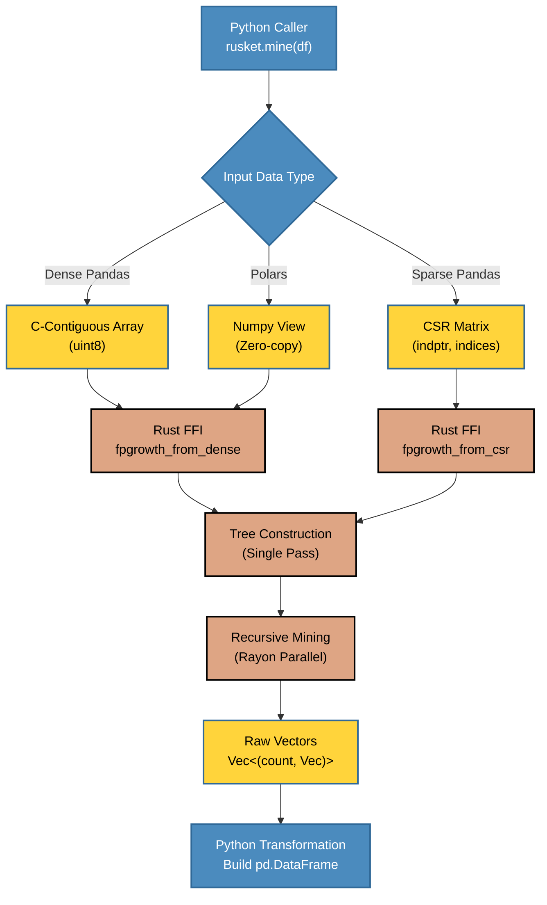

# Architecture

How rusket relies on Rust, PyO3, and Rayon for zero-copy, zero-allocation Python bindings.

rusket is structured as a thin Python layer over a Rust core, compiled as a native extension module via [PyO3](https://pyo3.rs) and [maturin](https://github.com/PyO3/maturin).

## Class hierarchy & API conventions

rusket has two class families: **Miners** (frequent pattern discovery) and **Recommenders** (collaborative filtering). All share common API patterns.

### Base classes

```
BaseModel (ABC)
├── Miner ─── FPGrowth, Eclat, FIN, LCM, FPGrowth (+ RuleMinerMixin)
│             PrefixSpan, HUPM (specialized miners)
├── ImplicitRecommender ─── ALS, BPR, EASE, ItemKNN, SVD, LightGCN
├── SequentialRecommender ─── FPMC, SASRec
└── FM (standalone, uses explicit feature matrices)
```

### Common conventions

| Convention | Rule |
|---|---|
| `from_transactions(data, transaction_col, item_col, verbose, **kwargs)` | Class method on every class. **Does NOT auto-fit.** Call `.fit()` explicitly on recommenders. |
| `from_pandas()`, `from_polars()`, `from_spark()` | Aliases delegating to `from_transactions()` |
| `fit(**args)` | Sklearn-compatible. Required after `from_transactions()` for recommenders. |
| `predict(**args)` | Sklearn-compatible alias for `recommend_items()` (recommenders) or `mine()` (miners). |
| `verbose: int` | `0` = silent, `1`+ = progress logs |
| `seed: int` | Random-seed parameter (never `random_state`) |
| `fitted: bool` | Attribute set to `True` after `.fit()` |
| `__repr__` | Every class has a `__repr__` showing key hyperparameters |
| Docstrings | NumPy-style (`Parameters`, `Returns`, `Raises`) |

### Miner interface

```python
miner = FPGrowth.from_transactions(df, transaction_col="tid", item_col="item")
freq  = miner.mine()                        # → pd.DataFrame (support, itemsets)
rules = miner.association_rules()            # → pd.DataFrame (metrics)
recs  = miner.recommend_for_cart(items, n=5) # → list[Any]
```

### Recommender interface

```python
# from_transactions() configures the model but does NOT fit
model = ALS.from_transactions(df, user_col="user", item_col="item", factors=64).fit()
ids, scores = model.recommend_items(user_id=0, n=10, exclude_seen=True)
```

| Method | Available on |
|---|---|
| `fit(interactions=None)` | All recommenders — accepts sparse matrix or uses data from `from_transactions()` |
| `predict(user_id, item_id)` | SVD (rating prediction); others: alias for `recommend_items()` |
| `recommend_items(user_id, n, exclude_seen)` | All recommenders |
| `recommend_users(item_id, n)` | ALS, SVD (others raise `NotImplementedError`) |
| `batch_recommend(n, exclude_seen, format)` | ALS, SVD |
| `user_factors` / `item_factors` | ALS, BPR, SVD, LightGCN |

### Sequential recommenders (FPMC, SASRec)

Work on ordered sequences. SASRec also accepts ad-hoc sequences:

```python
model = SASRec.from_transactions(df, user_col="user", item_col="item", timestamp_col="ts").fit()
ids, scores = model.recommend_items([1, 2, 3], n=10)
```

---

## Repository layout

```
rusket/
├── src/                          # Rust (PyO3)
│   ├── lib.rs                    # Module root — exports to Python
│   ├── fpgrowth.rs               # FP-Tree + FP-Growth algorithm
│   ├── association_rules.rs      # Rule generation + 12 metrics
│   └── common.rs                 # Shared helpers
├── python/
│   ├── rusket/                  # Primary Python package (pyproject.toml name)
│   │   ├── __init__.py
│   │   ├── fpgrowth.py           # Dispatch + numpy conversion
│   │   ├── association_rules.py  # Label mapping + Rust call
│   │   └── _validation.py        # Input validation helpers
│   └── fpgrowth_pyo3/            # Legacy compat package
│       └── ...
└── tests/
    ├── conftest.py
    ├── test_fpbase.py            # Shared base test classes
    ├── test_fpgrowth.py          # FP-Growth tests
    ├── test_association_rules.py # Association rules tests
    └── test_benchmark.py         # Performance benchmarks
```

---

## Data flow



---

## FP-Growth algorithm

The Rust implementation follows the classic Han et al. (2000) FP-Growth algorithm:

1. **Header table scan** — count item frequencies; prune items below `min_count`.
2. **FP-Tree construction** — single-pass over transactions; compress into a prefix-tree structure.
3. **Recursive mining** — for each frequent item, extract the conditional pattern base, build a conditional FP-Tree, and mine it recursively.
4. **Output** — each leaf path materialises as one frequent itemset `(count, items)`.

### Dispatch paths

| Path | Rust function | Input shape | Notes |
|---|---|---|---|
| Dense pandas | `fpgrowth_from_dense` | `[n_rows × n_cols]` uint8 | Contiguous C array |
| Sparse pandas | `fpgrowth_from_csr` | CSR `indptr + indices` | Zero-copy scipy CSR |
| Polars | `fpgrowth_from_dense` | same as dense | Arrow → NumPy view |

---

## Association rules

Rule generation is vectorised in Rust:

1. For each frequent itemset of length ≥ 2, enumerate all non-empty antecedent / consequent splits.
2. Look up antecedent and consequent supports from a pre-built hash map.
3. Compute all 12 metrics in a single pass; filter by `(metric, min_threshold)`.
4. Return raw integer index lists to Python; Python maps back to column names / tuples.

---

## Building from source

```bash
# Prerequisites: Rust 1.83+, Python 3.10+, uv
rustup update
uv sync

# Debug build (fast compile, slower runtime)
uv run maturin develop

# Release build (optimised)
uv run maturin develop --release

# Type checking
uv run basedpyright

# Tests
uv run pytest tests/ -x -q

# Cargo lint
cargo check
cargo clippy
```
